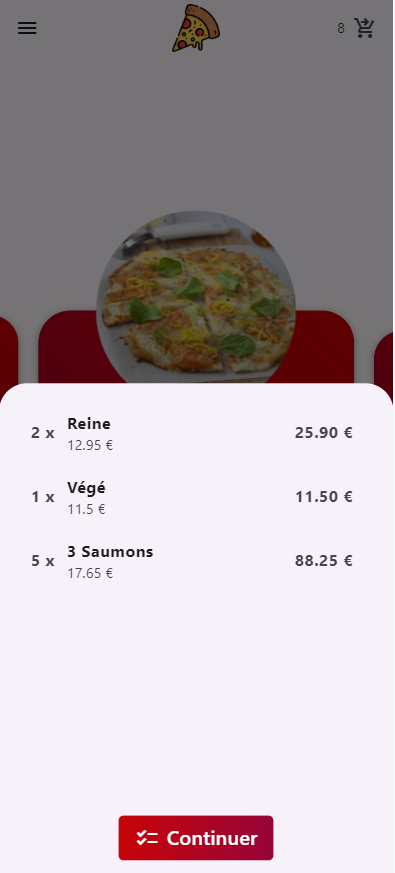

# APPIZZA

## :clipboard: Description
APPIZZA est une application mobile de commande de pizza créé en Dart avec le framework Flutter, couplé à une API RESTful créée avec le framework Node NestJS.
Cette application a été créée dans le cadre d'une remise de projet pour le module de Développement Mobile en 3INFO à EFFICOM LILLE.

Les fonctionnalités principales de l'application mobile sont les suivantes :
- Connexion et inscription à l'application
- Consultation de la liste de pizzas
- Création du panier avec incrémentation et décrémentation de la quantité de chaque pizza
- Validation de la commande
- Consultation de l'historique de commandes

Les fonctionnalités principales de l'API RESTful sont les suivantes :
- Création / connexion à un compte enregistré
- Sécurisation des routes via token d'authentification
- Requête pour la consultation de la liste de pizzas
- Requêtes pour l'ajout / consultation de commandes

## :hammer: Installation et exécution de l'application

Avant d'installer et d'exécuter l'application, assurez-vous d'avoir les outils nécessaires à l'exécution d'un projet Flutter (pour ce faire, installez Flutter et exécutez la commande `flutter doctor`).

Une fois les installations effectuées, clonez ce repository, dirigez-vous vers le dossier ==.\Frontend== et exécutez la commande `flutter run`.

Choisissez l'appareil sur lequel vous souhaitez démarrer l'application et validez.

Concernant l'API, les requêtes nécessaires sont déjà initialisées dans le projet et celle-ci est déjà hébergée à l'adresse [API_APPIZZA](https://appizza.vercel.app/).

## :computer: Utilisation de l'application

Au lancement de l'application, inscrivez-vous si vous n'avez pas de compte, auquel cas connectez-vous avec vos identifiants précédemment renseignés. Un système d'encryptage de mot de passe est utilisé dans l'objectif de sécurisation des données d'utilisateur. 

Une fois inscrit (ou connecté), vous serez redirigé vers la page d'accueil. Dans cette page, vous retrouverez toutes les pizzas disponibles, leur prix et leur note.
Naviguez à travers le carousel et incrémentez le compteur des pizzas que vous souhaitez commander.
La quantité de pizzas commandées est affichée à côté de l'icône de panier dans l'angle supérieur droit de l'application.

Vous pouvez cliquer sur l'icône de panier afin d'obtenir un récapitulatif de votre commande et d'accéder à la page de validation de commande

Une fois dans la page de validation de commande, renseignez votre adresse et validez votre commande. Une boîte d'alerte s'affichera à la création de la commande et votre panier sera vidé. Vous pouvez également retourner sur la page d'accueil en cliquant sur la flèche située dans l'angle supérieur gauche de l'application.

Dans la page d'accueil, vous trouverez une icône appelée "menu burger" dans l'angle supérieur gauche. Cliquer sur cette icône vous affichera une fenêtre avec plusieurs fonctionnalités.

<!-- Image affichant la fenêtre du menu burger à ajouter -->

Tout d'abord, vous pourrez faire basculer le thème de l'application, en passant alors du thème clair au thème sombre (et inversement). Vous pouvez également vous déconnecter, ce qui vous redirigera vers la page de connexion.

Enfin, vous avez accès à une page nommée "Historique", qui, une fois sélectionnée, vous redirige vers la liste de vos anciennes commandes.

Vous pourrez alors cliquer sur la commande de votre choix afin de retracer le contenu de la commande mais aussi son prix. L'identifiant utilisé pour nommer les commandes est commun à tous les utilisateurs, ce qui explique des numéros de commande manquants dans votre liste.

<!-- Image affichant l'historique des commandes à ajouter -->

## :handshake: Crédits

- @TristanRib - Page d'authentification, relation application - API, routage, providers, fenêtre de fonctionnalités, architecture d'application
- @ThomBsn - Design d'application, page d'accueil, page de commande 
- @nvan-duysen - API, page d'historique des commandes

## :memo: License

<!-- License à ajouter -->
